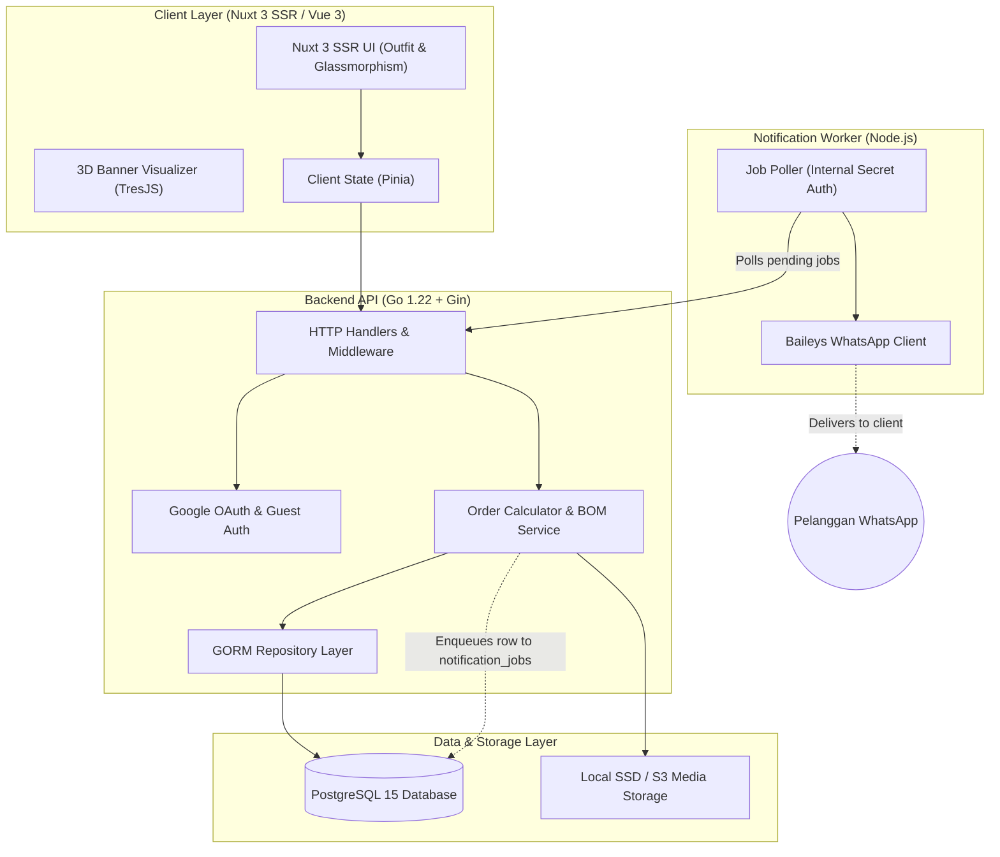

<div align="center">

# 🖨️ Rajaku Printing — Web-to-Print ERP & Order Management System
### *High-Performance Modular Monolith Powered by Go (Golang), Nuxt 3, PostgreSQL, & WhatsApp Microservice*

[](https://golang.org)
[](https://gin-gonic.com)
[](https://nuxt.com)
[](https://vuejs.org)
[](https://postgresql.org)
[](#-microservice-whatsapp-gateway-baileys)
[](#-uiux-pro-max-frontend-design)

<p align="center">
  <b>Ekosistem Otomasi Percetakan Digital & Manajemen Order Terintegrasi</b><br>
  Dirancang untuk menangani alur bisnis percetakan berskala tinggi: kalkulasi otomatis luas meter persegi & varian finishing (mata ayam/selongsong), verifikasi file desain, sistem antrean notifikasi WhatsApp anti-ban, dan panel kasir POS walk-in.
</p>

[Fitur Utama](#-fitur-unggulan-sistem) • [Arsitektur UI/UX](#-uiux-pro-max-frontend-design) • [Diagram Arsitektur](#-arsitektur-dan-alur-data) • [Microservice WhatsApp](#-microservice-whatsapp-gateway-baileys) • [Panduan Setup](#-panduan-instalasi-lokal)

---

</div>

## 🌟 Fitur Unggulan Sistem

### 1. Web-to-Print Engine & Kalkulator Otomatis
- **Instant Meter & Finishing Calculator:** Perhitungan harga instan berdasarkan dimensi presisi ($P \times L$), ketebalan bahan (Flexi China 280g, Korcin 440g, Albatros, Luster), dan varian finishing (mata ayam sudut, selongsong bambu, lembaran bersih).
- **Interactive 3D Product Preview (TresJS):** Visualisasi realistis produk standing banner, roll up, dan spanduk secara 3D langsung di browser pelanggan sebelum checkout.
- **Auto Image Optimization:** Konversi otomatis aset desain resolusi tinggi ke format WebP terkompresi tanpa mengurangi ketajaman visual cetak.

### 2. Manajemen Order & Kasir Percetakan (POS Walk-in)
- **POS Direct Print Bypass:** Jalur kilat kasir untuk pelanggan offline (walk-in) yang membawa file cetak langsung di flashdisk tanpa mewajibkan upload ulang ke cloud server.
- **Audit Trail Penggabungan Akun (`customer_merges`):** Saat pelanggan walk-in kemudian mendaftar akun online, seluruh riwayat order lama ditautkan otomatis dengan riwayat audit transaksional yang aman.
- **Invoice & Surat Jalan PDF:** Pembuatan otomatis invoice transaksi ber-QRIS dan dokumen surat jalan siap cetak.

### 3. Keamanan & Konvensi Backend Go
- **Clean Architecture Monolith:** Pemisahan ketat antara layer `Handler (HTTP Transport) → Service (Domain Logic) → Repository (Database Access)`.
- **Fail-Fast Startup Validation:** Backend menolak berjalan saat booting jika ada konfigurasi environment atau dependensi database yang tidak valid.
- **Database Migrations:** Pengelolaan skema database yang version-controlled dan reversible menggunakan `golang-migrate`.

---

## 📱 Microservice WhatsApp Gateway (Baileys)

Untuk menjaga keandalan pengiriman pesan tanpa membebani performa backend transaksi utama, modul notifikasi dipisahkan menjadi *independent background worker*:
- **Pacing Acak & Jitter Anti-Ban:** Jeda acak antar pesan (3–9 detik) dengan kurva segitiga alami serta istirahat berkala untuk mencegah deteksi bot spam WhatsApp.
- **Circuit Breaker:** Penghentian klaim antrean otomatis jika gateway mendeteksi respon rate-limit dari WhatsApp server.
- **Persistent Session:** Sesi koneksi tersimpan aman dalam storage terenkripsi lokal sehingga worker tahan restart tanpa perlu scan ulang QR code.

---

## 🎨 UI/UX Pro Max Frontend Design

Antarmuka pelanggan Nuxt 3 dirancang menggunakan prinsip **UI/UX Pro Max**:

```
┌────────────────────────────────────────────────────────────────────────┐
│ UI/UX PRO MAX SPECIFICATION                                            │
├─────────────────────────────────┬──────────────────────────────────────┤
│ 📐 Typography Scale             │ Outfit (Display w800, Body w400/500) │
│ 🪟 Header & Glassmorphism       │ Frosted Glass + Backdrop Blur σ: 16  │
│ 👆 Touch Target Ergonomics      │ Min 44x44 px (Zero misclick layout)  │
│ 🫧 Micro-Interactions           │ Smooth spring transitions (motion-v) │
│ 🧊 3D Visualizer                │ WebGL Canvas Integration (TresJS)    │
│ 🌗 Contrast Calibration         │ WCAG AAA Accessible Dark & Light UI  │
└─────────────────────────────────┴──────────────────────────────────────┘
```

---

## 🏗️ Arsitektur dan Alur Data



---

## 🛠️ Teknologi & Pustaka Inti

| Komponen | Teknologi | Keterangan |
| :--- | :--- | :--- |
| **Backend API** | **Go 1.22+ (Golang)** | Gin Web Framework, GORM, Clean Architecture |
| **Database** | **PostgreSQL 15+** | Database relasional dengan skema ter-indeks dan UUID primary keys |
| **Migrasi DB** | **golang-migrate** | Eksekusi migrasi skema `up.sql` dan `down.sql` berurutan |
| **Frontend Web** | **Nuxt 3 (Vue 3)** | Universal SSR/SSG dengan performa Core Web Vitals optimal |
| **Animasi & 3D** | **TresJS & Motion-v** | Rendering canvas 3D WebGL interaktif dan transisi fluid |
| **CSS Framework** | **Tailwind CSS v3** | Desain utility-first dengan sistem token UI/UX Pro Max |
| **WA Gateway** | **Node.js (Baileys)** | Worker microservice polling database dengan perlindungan anti-ban |
| **Kontainerisasi** | **Docker & Compose** | Orkestrasi lingkungan pengujian lokal |

---

## 📁 Struktur Direktori

```text
rajaku-printing/
├── backend/                       # Layanan RESTful API (Go)
│   ├── cmd/api/                   # Entrypoint server (main.go)
│   ├── internal/
│   │   ├── auth/                  # Domain Autentikasi & Google OAuth
│   │   ├── catalog/               # Domain Produk, Kategori, & Bahan Cetak
│   │   ├── order/                 # Kalkulasi Meter, Finishing, & POS Logic
│   │   └── notification/          # Antrean Notifikasi Transaksional
│   ├── migrations/                # Berkas SQL Migrasi Database
│   └── pkg/                       # Shared Utilities (hash, phone, currency)
├── frontend/                      # Web Portal Publik & Kasir POS (Nuxt 3)
│   ├── components/                # Komponen Vue & Visualizer 3D TresJS
│   ├── composables/               # Business Logic & Pinia Stores
│   ├── pages/                     # Halaman Rute Katalog, Order, & Admin
│   └── assets/                    # Stylings & Tipografi Outfit
├── services/
│   └── notification-worker/       # Background Worker WhatsApp (Node.js)
│       ├── src/                   # Baileys Engine, Pacing, Circuit Breaker
│       └── package.json
└── docker-compose.yml             # Konfigurasi PostgreSQL Lokal
```

---

## 💻 Panduan Instalasi Lokal

### Prasyarat:
- **Go** >= 1.22
- **Node.js** >= 20.x
- **Docker** (untuk menjalankan container PostgreSQL lokal)

### 1. Menjalankan Database PostgreSQL (Docker)
```bash
# Jalankan PostgreSQL container di background
docker compose up -d postgres
```

### 2. Menjalankan Backend API (Go)
```bash
cd backend

# Siapkan environment konfigurasi lokal
cp .env.example .env

# Unduh module Go & jalankan server API
go mod tidy
go run ./cmd/api
```
*API akan aktif dan siap menerima request di:* `http://localhost:8080`

### 3. Menjalankan Frontend (Nuxt 3)
```bash
cd frontend

# Pasang dependensi & jalankan dev server
npm install
npm run dev
```
*Aplikasi web dapat dibuka melalui browser di:* `http://localhost:3000`

### 4. Menjalankan WhatsApp Worker
```bash
cd services/notification-worker

# Siapkan environment & jalankan worker
cp .env.example .env
npm install
npm start
```
*Pindai kode QR yang muncul pada terminal untuk menghubungkan gateway WhatsApp.*

---

## 🔒 Standar Keamanan & Zero-Trust Architecture
- **Fail-Safe Startup:** Server melakukan verifikasi integritas parameter konfigurasi sebelum membuka listener port HTTP.
- **Strict Internal Secret Header:** Komunikasi antara WhatsApp worker dan backend diverifikasi menggunakan secret key `X-Internal-Secret` berkekuatan 256-bit.
- **Sanitized SQL Queries:** Pencegahan SQL Injection menyeluruh menggunakan parameterized queries GORM.

---

<div align="center">
  <sub>CV Wanshou Niaga Utama — Solusi Percetakan Digital Berkualitas Tinggi. Seluruh hak cipta dilindungi.</sub>
</div>
